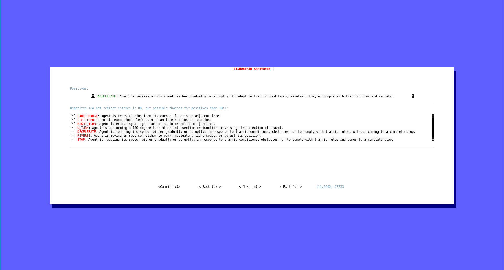

# STSBench: A Spatio-temporal Scenario Benchmark for Multi-modal Large Language Models in Autonomous Driving

<div align="left">
    <a href="https://huggingface.co/datasets/ivc-lrp/STSBench" target="_blank">
        
    </a>
</div>


<details>
  <summary>Abstract</summary>
We introduce STSBench, a scenario-based framework to benchmark the holistic understanding of vision-language models (VLMs) for autonomous driving. The framework automatically mines pre-defined traffic scenarios from any dataset using ground-truth annotations, provides an intuitive user interface for efficient human verification, and generates multiple-choice questions for model evaluation. Applied to the nuScenes dataset, we present STSBench, the first benchmark that evaluates the spatio-temporal reasoning capabilities of VLMs based on comprehensive 3D perception.  Existing benchmarks typically target off-the-shelf or fine-tuned VLMs for images or videos from a single viewpoint and focus on semantic tasks such as object recognition, captioning, risk assessment, or scene understanding. In contrast, STSBench evaluates driving expert VLMs for end-to-end driving, operating on videos from multi-view cameras or LiDAR. It specifically assesses their ability to reason about both ego-vehicle actions and complex interactions among traffic participants, a crucial capability for autonomous vehicles. The benchmark features 43 diverse scenarios spanning multiple views and frames, resulting in 971 human-verified multiple-choice questions. A thorough evaluation uncovers critical shortcomings in existing models’ ability to reason about fundamental traffic dynamics in complex environments. These findings highlight the urgent need for architectural advances that explicitly model spatio-temporal reasoning. By addressing a core gap in spatio-temporal evaluation, STSBench enables the development of more robust and explainable VLMs for autonomous driving.
</details>

# Installation
Install the requirements:
```bash
python3 -m venv venv
source venv/bin/activate
pip install -r requirements
```

# STSnu Dataset Generation

STSBench extracts scenarios from the [nuScenes](https://arxiv.org/pdf/1903.11027) dataset and subsequently derives multiple-choice questions. This process involves the following steps:

## Preparing nuScenes Data

This step involves extracting and formatting the ground truth data from the nuScenes dataset. The resulting format is specifically designed to facilitate consecutive scenario mining and the generation of multiple-choice questions.
```bash
python nuscenes_extractor.py --dataroot <path to>/nuscenes/v1.0-trainval/ --db_path nuScenes.db
```

## Scenario Mining
We automatically mine the pre-defined scenarios and save them in a scenario database. 
```bash
python mine_maneuvers.py --db_path nuScenes.db
```

## Scenario Sampling
To achieve a more balanced benchmark, we optionally sample over-represented scenarios. This step mitigated the impact of overly challenging examples by filtering out those with high occlusion and distant agents/objects.
```bash
python downsample_maneuvers.py --db_path nuScenes.db
```

## Verification

To ensure annotation quality, we employ a streamlined human verification process. Instead of exhaustive frame-by-frame review, annotators perform two key checks: Scenario Confirmation: Verify the presence of a mined scenario (rejecting false positives) and Negative Example Validation: Confirm that negative examples are indeed invalid (identifying false negatives).

```bash
python verify.py --dataroot <path to>/nuscenes/v1.0-trainval/ --db_path nuScenes.db
```

Our verification tool is built using [rerun](https://github.com/rerun-io/rerun) for visualization. An example of a verification scenario looks like:

<p align="center">
  
  
</p>

### Model Prompt Generation
Since different methods require different prompt styles and referals, we provide scripts to generate the prompts for every method we evaluated in the paper.

#### [Hugging Face](https://huggingface.co/datasets/ivc-lrp/STSBench)

```bash
python -m vqa_extractor.hf --db_path nuScenes.db --save_path STSnu.json
```

#### LLM ([Llama 3.2](https://www.llama.com/), [DeepSeek V3](https://arxiv.org/pdf/2412.19437), [GPT-4o](https://arxiv.org/pdf/2303.08774))

```bash
python -m vqa_extractor.llm --db_path nuScenes.db --save_path STSnu.json
```

#### [InternVL 2.5](https://arxiv.org/pdf/2312.14238)
```bash
python -m vqa_extractor.internvl --db_path nuScenes.db --save_path STSnu.json
```

#### [Qwen2.5-VL](https://arxiv.org/pdf/2412.15115)
```bash
python -m vqa_extractor.qwen --db_path nuScenes.db --save_path STSnu.json
```

#### [Senna-VLM](https://arxiv.org/pdf/2410.22313)
```bash
python -m vqa_extractor.senna --db_path nuScenes.db --save_path STSnu.json
```

#### [OmniDrive](https://arxiv.org/pdf/2405.01533)
```bash
python -m vqa_extractor.omnidrive --db_path nuScenes.db --save_path STSnu.json
```

#### [DriveMM](https://arxiv.org/pdf/2412.07689)
```bash
python -m vqa_extractor.drivemm --db_path nuScenes.db --save_path STSnu.json
```

### Inference and Evaluation
In the following we show how we infer different models (LLMs, VLMs, and expert models) and compute the evaluation. These scripts can be used to reproduce the paper results.

#### [Llama 3.2](https://www.llama.com/)

We self-host [Llama 3.2](https://ollama.com/library/llama3.2) using [Ollama](https://ollama.com/). Please follow the Ollama [installation guide](https://ollama.com/download) and start LLama 3.2 with:
```bash
ollama run llama3.2
```
Start inference and consequently evaluation with:
```bash
python -m eval.llama \
    --input_path STSnu_llama_3_2.json \
    --output_path STSnu_llama_3_2_out.json \
    --db_path nuScenes.db \
    --openai_base_url "http://localhost:11434/v1"
```

#### [DeepSeek V3](https://arxiv.org/pdf/2412.19437)
We utilize [DeepSeek API](https://api-docs.deepseek.com/) to infer DeepSeek and with the results compute the evaluation:
```bas
python -m eval.deepseek \
    --input_path STSnu_DeepSeek.json \
    --output_path STSnu_DeepSeek_out.json \
    --db_path nuScenes.db
```

#### [GPT-4o](https://arxiv.org/pdf/2303.08774)

Similarly, we utilize [OpenAI API](https://openai.com/api/) to infer GPT-4o and with the results compute the evaluation:
```bash
python -m eval.gpt \
    --input_path STSnu_GPT.json \
    --output_path STSnu_GPT_out.json \
    --db_path nuScenes.db
```

#### VLMs: [InternVL 2.5](https://arxiv.org/pdf/2312.14238) & [Qwen2.5-VL](https://arxiv.org/pdf/2412.15115)
For the VLMs we utilized [LMDeploy](https://github.com/InternLM/lmdeploy?tab=readme-ov-file). Please follow [intallation guide](https://github.com/InternLM/lmdeploy/blob/main/docs/en/get_started/installation.md) to get started.

The following script runs inference (uncomment the wanted model) and computes the evaluation:
```bash
# export MODEL="OpenGVLab/InternVL2_5-1B"
# export MODEL="Qwen/Qwen2.5-VL-7B-Instruct"
export MODEL="OpenGVLab/InternVL2_5-8B"
python -m eval.vlm \
    --input_path STSnu_${MODEL}.json \
    --output_path STSnu_${MODEL}_out.json \
    --model ${MODEL} \
    --db_path nuScenes.db
```
